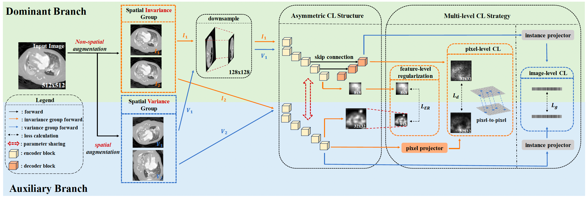

# MACL: Multi-level Asymmetric Contrastive Learning for Medical Image Segmentation Pre-training

[](https://ieeexplore.ieee.org/document/11419737)
[](https://github.com/stevezs315/MACL)
[](https://stevezs315.github.io/)


**Shuang Zeng, Lei Zhu, Xinliang Zhang, Qian Chen, Hangzhou He, Lujia Jin, Zifeng Tian, Zhaoheng Xie, Micky C Nnamdi, Wenqi Shi, J Ben Tamo, May D. Wang, Yanye Lu***

*MILab, Department of Biomedical Engineering*

*Corresponding Author: [yanye.lu@pku.edu.cn](mailto:yanye.lu@pku.edu.cn)*

---

## Introduction

Medical image segmentation usually requires large-scale expert annotations, which are expensive and time-consuming to obtain. Existing contrastive learning (CL) methods for medical image segmentation mainly pre-train the encoder with image-level representations, while the decoder is either randomly initialized during fine-tuning or pre-trained separately. This limits the collaboration between encoder and decoder and overlooks rich feature-level and pixel-level representations.

We propose **MACL**, a **M**ulti-level **A**symmetric **C**ontrastive **L**earning framework for medical image segmentation pre-training. MACL introduces an asymmetric one-stage pre-training structure to jointly optimize the encoder and decoder, and learns representations at three complementary levels:

- **Image-level global CL**: learns global semantic representations with position-aware contrastive pairs
- **Pixel-level dense CL**: captures fine-grained local semantics for dense prediction
- **Feature-level equivariant regularization**: aligns multi-scale feature representations between asymmetric branches

> **TL;DR:** MACL jointly pre-trains the encoder and decoder in one stage with image-level, pixel-level, and feature-level supervision, outperforming 11 contrastive learning strategies across 8 medical image segmentation datasets.


## Method Overview



MACL consists of two asymmetric branches:

1. **Dominant Branch**: encoder + partial decoder + projectors  
   The dominant branch jointly pre-trains the encoder and decoder. The input is downsampled before the encoder to align feature sizes and reduce GPU memory cost.

2. **Auxiliary Branch**: encoder + projectors  
   The auxiliary branch provides contrastive counterparts without using the decoder, which preserves sufficient negative pairs and keeps pre-training efficient.

The multi-level contrastive objective is:

$$
\mathcal{L}_{MLC} = \lambda_1 \mathcal{L}_{g} + \lambda_2 \mathcal{L}_{d} + \lambda_3 \mathcal{L}_{ER}
$$

where:

- $\mathcal{L}_{g}$: image-level global contrastive loss
- $\mathcal{L}_{d}$: pixel-level dense contrastive loss
- $\mathcal{L}_{ER}$: feature-level equivariant regularization loss

**Key modules:**

- **Asymmetric CL Structure**: adds a partial decoder only in the dominant branch to enable one-stage encoder-decoder pre-training
- **Global Contrastive Learning**: learns image-level semantic representations using position-aware positive pairs
- **Dense Contrastive Learning**: extends contrastive learning to pixel-level projections for fine-grained segmentation features
- **Equivariant Regularization**: enforces consistency between multi-scale feature representations from two branches

---

## Installation

```bash
conda create -n MACL python=3.8.16
conda activate MACL
pip install -r requirements.txt
```

---

## Model Weights

Pre-trained model weights will be released in `MACL/model_pth`.

| Model       | Pre-train Dataset             | Backbone |
| ----------- | ----------------------------- | -------- |
| MACL_CHD    | CHD (CT, 17525 slices)        | UNet     |
| MACL_BraTS  | BraTS2018 (MRI, 39064 slices) | UNet     |
| MACL_KiTS   | KiTS2019 (CT, 32332 slices)   | UNet     |

---

## Dataset Preparation

### Pre-training Datasets (Upstream, Unlabeled)

| Dataset   | Modality | Size         | Usage                                |
| --------- | -------- | ------------ | ------------------------------------ |
| CHD       | CT       | 17525 slices | Multi-organ CT pre-training          |
| BraTS2018 | MRI      | 39064 slices | MRI multi-organ / ROI pre-training   |
| KiTS2019  | CT       | 32332 slices | ROI CT pre-training                  |

- Congenital Heart Disease (CHD), [link](https://www.kaggle.com/datasets/xiaoweixumedicalai/chd68-segmentation-dataset-miccai19)
- BraTS2018, [link](https://www.med.upenn.edu/sbia/brats2018/data.html)
- KiTS2019, [link](https://kits19.grand-challenge.org/)

### Fine-tuning Datasets (Downstream)

| Dataset         | Modality   | Task                         | Size         |
| --------------- | ---------- | ---------------------------- | ------------ |
| ACDC            | MRI        | Multi-organ (LV/RV/Myo)      | 100 patients |
| MMWHS           | CT         | Multi-organ (7 structures)   | 20 patients  |
| HVSMR           | MRI        | Multi-organ (Blood pool/Myo) | 10 patients  |
| CHAOS           | MRI        | Multi-organ (4 regions)      | 20 patients  |
| MSD-Heart       | MRI        | ROI (Left atrium)            | 20 patients  |
| MSD-Hippocampus | MRI        | ROI (Hippocampus)            | 260 patients |
| MSD-Spleen      | CT         | ROI (Spleen)                 | 41 patients  |
| ISIC2018        | Dermoscopy | ROI (Skin lesion)            | 2594 images  |

- ACDC, [link](https://www.creatis.insa-lyon.fr/Challenge/acdc/databases.html)
- MMWHS, [link](https://zmiclab.github.io/zxh/0/mmwhs/)
- HVSMR, [link](http://segchd.csail.mit.edu/)
- CHAOS, [link](https://chaos.grand-challenge.org/Combined_Healthy_Abdominal_Organ_Segmentation/)
- MSD, [link](http://medicaldecathlon.com/)
- ISIC2018, [link](https://challenge.isic-archive.com/landing/2018/)

### Pre-processing

Use the `generate_xxx.py` scripts in the `dataset` folder to convert original medical volumes into `.npy` or `.png` files for training and testing.

```bash
# convert the xxx dataset
python generate_xxx.py \
    -indir raw_image_dir \
    -labeled_outdir save_dir_for_labeled_data \
    -unlabeled_outdir save_dir_for_unlabeled_data
```

The paper follows a unified 2D slice-based pre-processing protocol. Cardiac datasets are resampled and normalized according to dataset-specific spacing and intensity ranges; BraTS2018 is converted into axial slices; KiTS, CHAOS, and MSD tasks are saved in numpy or PNG format for compatibility with 2D training.

---

## Pre-training

```bash
# Pre-train on CHD dataset (CT, for multi-organ segmentation)
CUDA_VISIBLE_DEVICES=0,1 python -m torch.distributed.launch --nnodes=1 --nproc_per_node=2 --master_port 21604 \
train_contrast.py --device cuda:0 \
--model_name UNet2D_MACL --find_unused_parameters \
--dataset chd --batch_size 16 --checkpoint_pretrain_interval 5 --epochs 100 \
--data_dir "/data/zs_data/datasets/chd/out_unlabeled/" --do_contrast --lr 0.01 \
--experiment_name CHD_pretrain_your_experiment_name_ --save JCL --slice_threshold 0.1 \
--temp 0.1 --patch_size 512 512 --initial_filter_size 32 --classes 512 \
--contrastive_method pcl --GPU_Name '0,1' --scale_factor 0.25 --pixel_use \
--parallel DDP --alpha 0.5 --alpha_ER 1.0 --AMP --n_segments 100 --compactness 10

# Pre-train on BraTS2018 (MRI, for multi-organ / ROI segmentation)
CUDA_VISIBLE_DEVICES=0,1 python -m torch.distributed.launch --nnodes=1 --nproc_per_node=2 --master_port 21182 \
train_contrast.py --device cuda:0 \
--model_name UNet2D_MACL --find_unused_parameters \
--dataset BraTS --batch_size 32 --checkpoint_pretrain_interval 10 --epochs 100 \
--data_dir "/data1/zs_data/BraTS_unlabeled/unlabeled" --do_contrast --lr 0.01 \
--experiment_name BraTS_pretrain_your_experiment_name_ --save JCL --slice_threshold 0.05 \
--temp 0.1 --patch_size 192 192 --initial_filter_size 32 --classes 512 \
--contrastive_method pcl --GPU_Name '0,1' --scale_factor 0.25 \
--pixel_use --parallel DDP --alpha 0.5 --alpha_ER 1.0 --AMP \
--mode pretrain --n_segments 100 --compactness 10

# Pre-train on KiTS2019 (CT, for ROI segmentation)
CUDA_VISIBLE_DEVICES=0,1 python -m torch.distributed.launch --nnodes=1 --nproc_per_node=2 --master_port 29244 \
train_contrast.py --device cuda:0 \
--model_name UNet2D_MACL --find_unused_parameters \
--dataset KiTS --batch_size 16 --checkpoint_pretrain_interval 10 --epochs 100 \
--data_dir "/mnt/nasv3/zs/datasets/KITS" --do_contrast --lr 0.01 \
--experiment_name KiTS_pretrain_your_experiment_name_ --save JCL --slice_threshold 0.1 \
--temp 0.1 --patch_size 512 512 --initial_filter_size 32 --classes 512 \
--contrastive_method pcl --GPU_Name '0,1' --scale_factor 0.25 --pixel_use \
--parallel DDP --alpha 0.5 --alpha_ER 1.0 --AMP \
```

### Key Pre-training Parameters

| Parameter          | Value | Description                                            |
| ------------------ | ----- | ------------------------------------------------------ |
| `--epochs`         | 100   | Pre-training epochs                                    |
| `--batch_size`     | 16    | Batch size per GPU                                     |
| `--lr`             | 0.1   | Initial learning rate, cosine-decayed to 0             |
| `--temp`           | 0.1   | Temperature for contrastive loss                       |
| `--lambda_global`  | 1.0   | Weight for image-level global CL, $\mathcal{L}_{g}$    |
| `--lambda_dense`   | 0.5   | Weight for pixel-level dense CL, $\mathcal{L}_{d}$     |
| `--lambda_er`      | 1.0   | Weight for equivariant regularization, $\mathcal{L}_{ER}$ |
| `--scale_factor`   | 0.25  | Downsampling scale for the dominant branch             |
| `--classes`        | 512   | Projection dimension for contrastive pre-training      |

---

## Fine-tuning

*bash finetune.sh*

```bash
# Fine-tune on ACDC with 10% / 25% annotations
samples=("8" "20") # 8, 20
for sample in "${samples[@]}";
do
echo "sample=${sample}";
CUDA_VISIBLE_DEVICES=0,1 python -m torch.distributed.launch --nnodes=1 --nproc_per_node=2 --master_port 24895 \
train_supervised.py --device cuda:0 --ssl_method JCL \
--pretrained_model_path 'model_pth/MACL_CHD.pth' --restart \
--batch_size 5 --epochs 100 \
--data_dir "dataset/acdc/out_labeled/" \
--lr 5e-4 --min_lr 5e-6 --dataset acdc --patch_size 352 352 \
--experiment_name ACDC_CHD_your_experiment_name_"${sample}"_ --save epochs_100_batchsize_5x2GPU_lr_5e-6-5e-4 \
--initial_filter_size 32 --classes 4 --enable_few_data --sampling_k "${sample}" \
--data_split_list data_split_list.txt \
--parallel DDP --checkpoint_finetune_interval 10 --GPU_Name '0,1' \
--model_name 'UNet2D_JCL'
done
```

During fine-tuning, the two-block decoder used in pre-training is extended to the full decoder to produce full-resolution segmentation maps.

---

## Project Structure

```text
MACL/
├── assets/               # Figures and illustrations
├── checkpoints/          # Pre-trained model weights
├── data/                 # Dataset directory
├── models/
│   ├── unet.py           # UNet backbone
│   ├── macl.py           # MACL pre-training framework
│   └── modules/
│       ├── projector.py  # Image-level and pixel-level projectors
│       ├── decoder.py    # Partial decoder for asymmetric pre-training
│       └── losses.py     # Multi-level contrastive losses
├── datasets/             # Dataset loaders and pre-processing scripts
├── utils/
│   ├── augmentations.py  # Spatial / non-spatial augmentations
│   └── metrics.py        # Evaluation metrics
├── scripts/              # Training and evaluation scripts
├── train_contrast.py     # Pre-training entry point
├── finetune.py           # Fine-tuning entry point
├── eval.py               # Evaluation entry point
├── requirements.txt
└── README.md
```

---

## Citation

If you find MACL useful in your research, please cite our paper:

```bibtex
@ARTICLE{MACL,
  author={Zeng, Shuang and Zhu, Lei and Zhang, Xinliang and Chen, Qian and He, Hangzhou and Jin, Lujia and Tian, Zifeng and Xie, Zhaoheng and Nnamdi, Micky C and Shi, Wenqi and Tamo, J Ben and Wang, May D. and Lu, Yanye},
  journal={IEEE Journal of Biomedical and Health Informatics}, 
  title={Multi-level Asymmetric Contrastive Learning for Medical Image Segmentation Pre-training}, 
  year={2026},
  volume={},
  number={},
  pages={1-14},
  keywords={Decoding;Image segmentation;Contrastive learning;Medical diagnostic imaging;Feature extraction;Training;Collaboration;Bioinformatics;Representation learning;Annotations;Medical Image Segmentation;Self-supervised Learning;Contrastive Learning},
  doi={10.1109/JBHI.2026.3669549}}
```

---

## Contact

- **Shuang Zeng** (First Author): [stevezs@pku.edu.cn](mailto:stevezs@pku.edu.cn)
- **Yanye Lu** (Corresponding Author): [yanye.lu@pku.edu.cn](mailto:yanye.lu@pku.edu.cn)

For questions and issues, please open a [GitHub Issue](https://github.com/stevezs315/MACL/issues).

---

## Acknowledgement

This codebase builds upon [PCL](https://github.com/dewenzeng/positional_cl). We thank the authors for their excellent work and for releasing their code.

